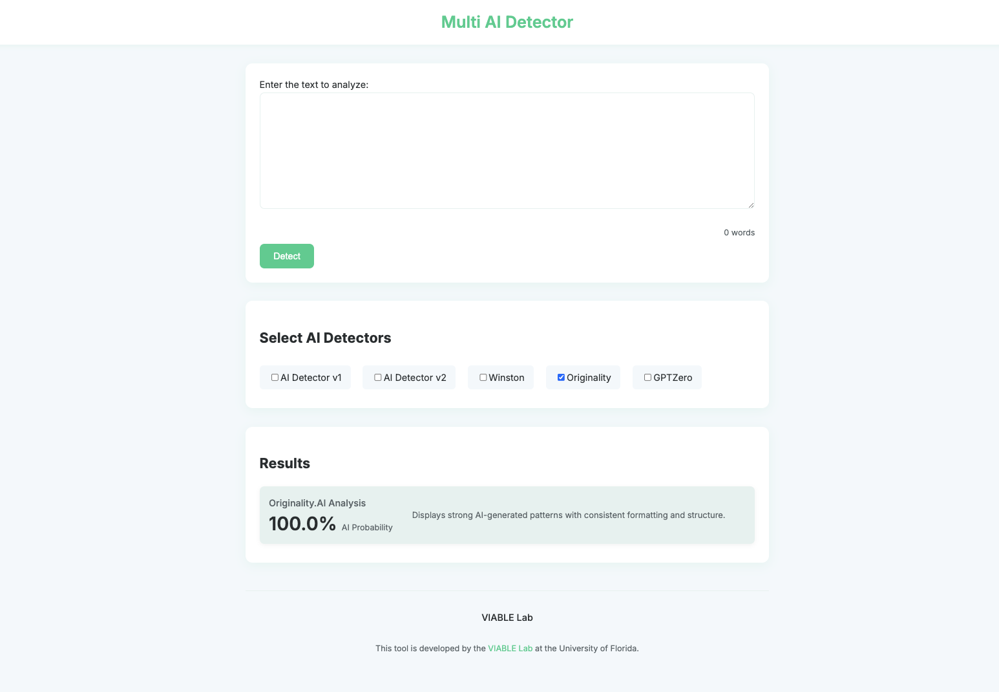

# Multi AI Detector

## Overview

Multi AI Detector is a web application that allows users to analyze text using multiple AI detectors. It provides an interface to input text and select from various AI detectors to evaluate the entered text. The results from the selected detectors are then displayed, offering a comprehensive analysis of the text.

 

## Features

- **Multiple AI Detectors**: Choose from various AI detectors to analyze text.
- **Dynamic Results Display**: Results from the selected detectors are displayed dynamically.
- **Responsive Design**: The application is designed to be used on devices of all sizes.
- **Settings Customization**: Customize settings to show/hide detectors and manage API keys.

## Included AI Detectors
- AI Detector v1
- AI Detector v2
- Winston.ai
- Originality.ai
- GPTZero
- (Looking forward to any further suggestions you may have for integrating more AI detectors...)

## How to Use

1. Enter the text to be analyzed in the text area.
2. Select the detectors you want to use for the analysis.
3. Click "Detect" and view the results.
4. Visit the settings to customize which detectors to display and enter API keys.

## Live Demo

Visit [Multi AI Detector](https://www.chatcatgpt.org/multi-ai-detector) to try the application live.

## Technology Stack

- HTML5
- CSS3
- JavaScript

## Setup and Installation

1. Visit the [website](https://www.chatcatgpt.org/multi-ai-detector) and click "Try it NOW".
   
   -or-
   
2. Clone the repository and open `index.html` in your browser.

## Contribute

Feel free to contribute to this project! Fork the repository, make your changes, and submit a pull request!

## License

This project is licensed under the MIT License.
